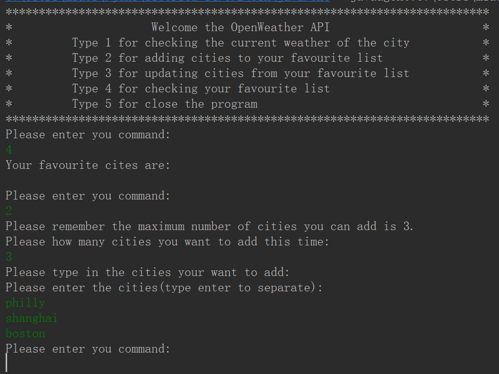
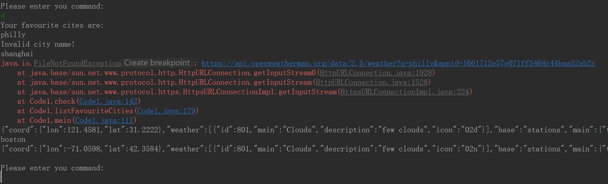
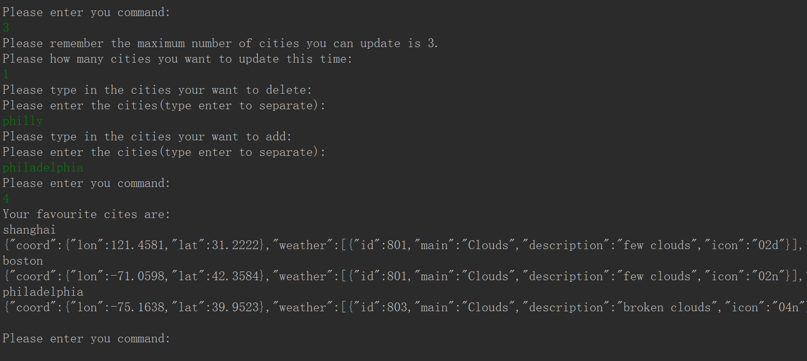
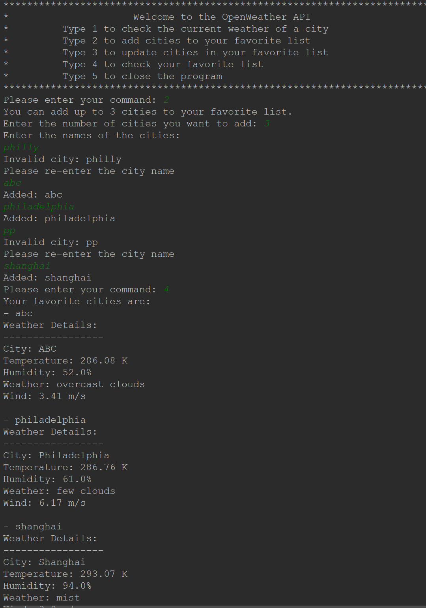
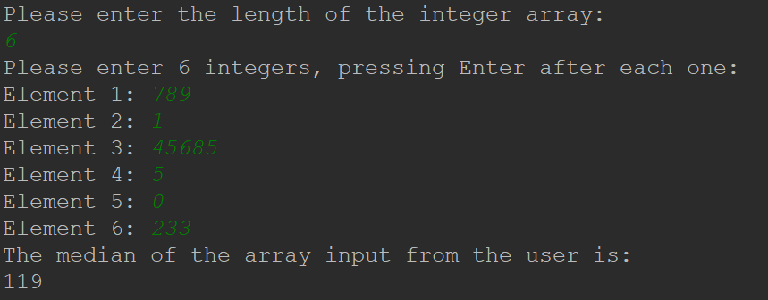
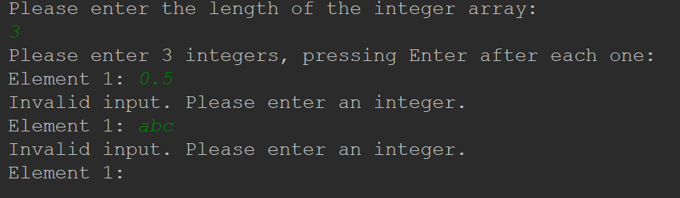

# GCS_CA

GCS Coding Assessment from Yicheng Jiang.

Two coding activity files are both in side the src folder

## Code1 is Making API Calls

### Future Upgrades(2/2):

1. (Achieved)~~Adding the edge cases for checking the incorrect city names.~~

2. (Achieved)~~Create Map to store the JSON date with better outputs.~~

### Edge Case 1: Invalid City Name

Fix Method:

Add a wrong name to the favourite list


Output wrong message


Use update feature to replace the invalid city


### Edge Case 2: Outputs Optimization 

Fix Method:

Add gson package
```
// Parse JSON response into a Map
      Gson gson = new Gson();
      Map<String, Object> weatherData = gson.fromJson(result.toString(), Map.class);
```


## Code2 is Pseudocode to Code

### Inputs handled:


### Edge Case: Invalid Inputs


### Time and Space Complexity:
1. Time: 𝑂(𝑛log𝑛)
2. Space: 𝑂(𝑛)